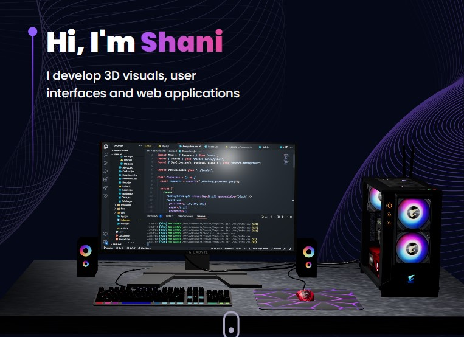

# 3D_Three.js_WebProject



<p align="center" style="text-shadow: 2px 2px 5px purple; font-size:25px">
Amazing 3D Web app using three.js library,</br> Learning 3D library and animation library.
</p>
<p align="center">


</p>

## Technologies and Standards Used in UI/UX

**There are various tools that have been used throughout the project design and development:**
| Tools | Usage |
|---------------------------------------------------|---------------------------------------------------|
| vite react | For development environment |
| [React-Typescript](https://react-typescript-cheatsheet.netlify.app/) | strongly typed programming language |
| [Tailwind CSS](https://tailwindcss.com/) | A utility-first CSS framework |
| [React-three-fiber](https://docs.pmnd.rs/react-three-fiber/getting-started/introduction) | A React renderer for three.js |
| [Framer Motion](https://www.framer.com/motion/) | A production-ready motion library for React |
| [SVGOMG](https://jakearchibald.github.io/svgomg/) | For refining and compressing SVGs |
| [TinyPng](https://tinypng.com/) | For JPEG/PNG Image Compression |

## Demo

- Click here : shani-vite-three.infinityfreeapp.com

## Run Locally

Clone the project

```bash
  git clone https://github.com/shani24levi/3D_Three.js_WebProject
```

Install dependencies

```bash
  npm install
```

Start

```bash
  npm run dev
```
